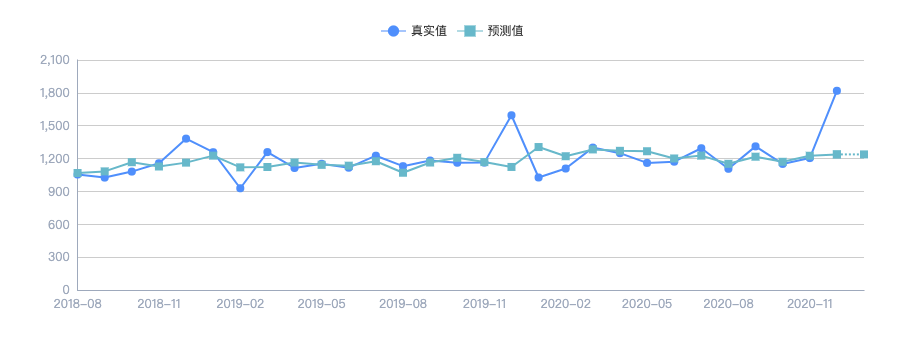

<!--
 * @Author: tangdaoyong
 * @Date: 2021-07-07 17:14:07
 * @LastEditors: tangdaoyong
 * @LastEditTime: 2021-07-07 17:23:21
 * @Description: 折线图线分两段，样式不一样
-->
# 折线图线分两段，样式不一样

使用**两条线**实现。一条`实线`一条`虚线`，实线尾部和虚线首部是同一个点，这就实现了`折线图线分两段，样式不一样`的效果。需要处理的是交接点的弹窗。

```js
/**
* 获取option
* @param {*} data 
* @returns 
*/
const getPredictRealOption = (data) => {
    let dataList = data.datas;
    if (!isArray(dataList)) {
        return {};
    }
    let legendData = ['真实值', '预测值'];
    // 时间轴线
    let xAxisData = dataList.map((item) => item.date);
    // 真实值数据
    let exchangeRealList = cloneDeep(dataList).map((item) => {
        item.value = item.real;
        return item;
    }).filter((item) => isNotEmpty(item.value));
    // 预测值数据
    let exchangePredictList = cloneDeep(dataList).map((item) => {
        item.value = item.predict;
        return item;
    }).filter((item) => isNotEmpty(item.value));
    // 已经到期的预测
    let oldPredictList = exchangePredictList;
    // 未到期的预测
    let newPredictList = [];
    if (oldPredictList.length > exchangeRealList.length) {
        oldPredictList = oldPredictList.slice(0, exchangeRealList.length);
        newPredictList = [...new Array(exchangeRealList.length - 1).fill(null), ...exchangePredictList.slice(exchangeRealList.length - 1)];
    }
    let option = {
        tooltip: {
            axisPointer: {
                type: 'none' // 隐藏坐标提示器
            },
            trigger: 'axis',
            backgroundColor: 'transparent',
            formatter: function (v) {
                if (!isArray(v)) {
                    return null;
                }
                // 显示处理
                let strs = [];
                let adds = [];// 已经显示的，交接处处理
                v.map((item, index) => {
                    if (index === 0) {
                        strs.push(`<h4 class='title'>${item.data.date}</h4>`);
                    }
                    let name = item.seriesName;
                    let value = item.value;
                    if (isNotEmpty(value) && adds.indexOf(name) === -1) {
                        let color = '#67B8CA';
                        if (name === '真实值') {
                            color = '#4F8FFC';
                        }
                        if (name === '预测值') {
                            color = '#FFB116';
                        }
                        adds.push(name);
                        strs.push(`<p>${name}：<span style='color:${color}'>${value}</span></p>`);
                    }
                });
                return `<div class='echartsTooltip'>
                            ${strs.join('')}
                        </div>`;
            }
        },
        legend: {
            selectedMode: false,
            data: legendData,
            top: 20,
            show: true
        },
        grid: {
            left: '40',
            right: '40',
            bottom: '40',
            containLabel: true
        },
        xAxis: {
            type: 'category',
            boundaryGap: false,
            data: xAxisData,
            axisLine: {
                lineStyle: {
                    color: '#9ea9bc'
                }
            },
            splitLine: {
                lineStyle: {
                    color: '#d8dce4'
                }
            },
            axisTick: {
                show: false
            },
            axisLabel: {
                color: '#9EA9BC'
            }
        },
        yAxis: {
            type: 'value',
            axisLine: {
                lineStyle: {
                    color: '#9ea9bc'
                }
            },
            axisTick: {
                show: false
            },
            axisLabel: {
                color: '#9EA9BC'
            }
        },
        series: [
            {
                name: '真实值',
                type: 'line',
                symbol: 'circle',
                symbolSize: 8,
                itemStyle: {
                    color: '#4F8FFC'
                },
                data: exchangeRealList
            },
            {
                name: '预测值',
                type: 'line',
                symbol: 'rect',
                symbolSize: 8,
                itemStyle: {
                    color: '#67B8CA'
                },
                data: oldPredictList
            },
            {
                name: '预测值',
                type: 'line',
                symbol: 'rect',
                symbolSize: 8,
                itemStyle: {
                    color: '#67B8CA'
                },
                lineStyle: {
                    type: 'dotted'
                },
                data: newPredictList
            }
        ]
    };
    return {
        title: data.exchange,
        option
    };
};
```

```jsx
/**
* 获取跨境资金流动预测dom
* @returns 
*/
const getPredictRealDom = () => {
    let max = predictRealOptions.length;
    if (max < 0) {
        return null;
    }
    let dom = [];
    for (let i = 0; i < max; i += 2) {
        const left = predictRealOptions[i];
        let right = null;
        if (i + 1 < max) {
            right = predictRealOptions[i + 1];
        } else {
            continue;
        }
        dom.push(
            <div className={styles.line}>
                <div className={styles.left}>
                    <div className={styles.container}>
                        <div className={styles.title}>
                            <span>{ left.title }</span>
                        </div>
                        <div className={styles.chartContainer}>
                            <ReactEcharts
                                style={{ height: '100%', width: '100%' }}
                                option={ left.option }
                            />
                        </div>
                    </div>
                </div>

                {
                    right && <div className={styles.right}>
                        <div className={styles.container}>
                            <div className={styles.title}>
                                <span>{ right.title }</span>
                            </div>
                            <div className={styles.chartContainer}>
                                <ReactEcharts
                                    style={{ height: '100%', width: '100%' }}
                                    option={ right.option }
                                />
                            </div>
                        </div>
                    </div>
                }
            </div>
        );
    }
    return dom;
};
```
实现效果如下：

