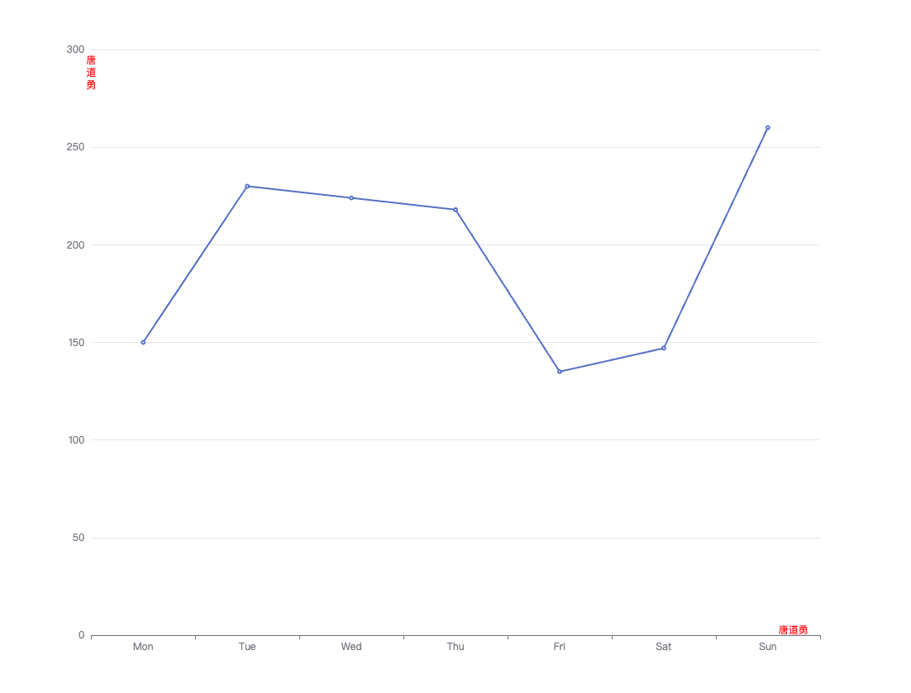

<!--
 * @Author: matiastang
 * @Date: 2022-08-09 13:39:11
 * @LastEditors: matiastang
 * @LastEditTime: 2022-08-09 13:44:21
 * @FilePath: /matias-ECharts/md/设置yAxis的name显示.md
 * @Description: 设置yAxis的name显示
-->
# 设置yAxis的name换行显示

今天同事问我设置过`Echarts`的`yAxis`的`name`换行显示没，印象中好像是没有，但感觉能设置。开始以为通过`旋转`+`宽高之类`的能实现，后面发现需要的效果是字是竖着的，通过查阅文档通过设置富文本的方式变相实现该功能。



```js
option = {
  xAxis: {
    type: 'category',
    data: ['Mon', 'Tue', 'Wed', 'Thu', 'Fri', 'Sat', 'Sun'],
    name: '唐道勇',
    nameGap: -50,
    nameTextStyle: {
      color: '#ff0000',
      verticalAlign: 'bottom'
    },
  },
  yAxis: {
    type: 'value',
    name: [
        '{a|唐}',
        '{a|道}',
        '{a|勇}',
    ].join('\n'),
    nameTextStyle: {
      color: '#ff0000',
      rich: {
            a: {
                color: 'red',
                lineHeight: 15
            },
      }
    },
    nameGap: -50
  },
  series: [
    {
      data: [150, 230, 224, 218, 135, 147, 260],
      type: 'line'
    }
  ]
};
```